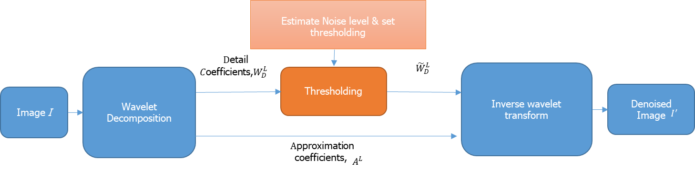
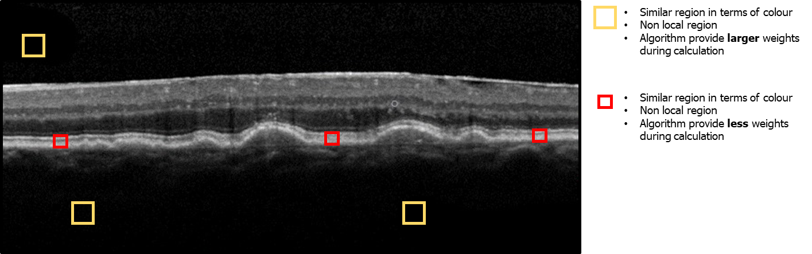
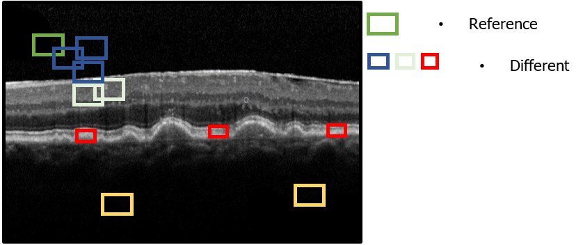

# Traditional OCT image denoising method:

## Wavelet :
Wavelet transform-based methods are also effective means to reduce noise. First image signal I is decomposed using 
the discrete wavelet transform into the various wavelet coefficients generally the approximation coefficients A^L and detail coefficients W_D^L.Then the detailed coefficients are thresholded by some thresholding mechanism (namely universal threshold method or Visoshrink method, base method, shear method and minimax method) which outputs a new thresholded detail coefficient  W ̃_D^L   and the approximation coefficients are remain unchanged. 
Then we collect all these wavelet coefficients and taking the inverse transform to get the denoised image or signal I^'.
To estimate the noise level in an image we choose some threshold value to threshold or to shrink the insignificant wavelet detailed 
coefficients values. The Wavelet coefficients which are small in value is considered as noise. So wavelet denoising, or wavelet thresholding 
allows us to "shrink" or remove those coefficients without affecting the signal or image quality
. To implement this first image pixel is shifted to a certain value, then wavelet decomposition is applied. 
From here speckle noise is suppressed by applying some thresholding value and then inverse wavelet transform is applied to get noise reduction image.

   
  

## Bilateral Filtering
It is highly effective in noise removal while keeping edges sharp. It takes into account of both space and intensity of 
a pixel in an image. While Gaussian filter takes the neighbourhood around the pixel and discovers its Gaussian weighted average.
 This Gaussian filter is a function of space alone, that is, nearby pixels are considered while filtering. It doesn't consider 
 whether pixels have almost the same intensity. It doesn't consider whether a pixel is an edge pixel or not. So it obscures the edges
  additionally which causes low exactness. On the other hand Bilateral filtering also takes a Gaussian filter in space, 
  but one more Gaussian filter which is a function of pixel difference. The Gaussian function of space makes sure that only 
  nearby pixels are considered for blurring, while the Gaussian function of intensity difference makes sure that only those 
  pixels with similar intensities to the central pixel are considered for blurring. So it preserves the edges since pixels at 
  edges will have large intensity variation. 

## NLM: 

Non Local Means (NLM) algorithm is mostly used in denoising technique in the field of tomography images, MRI images,  
CT images images or any microscopic images etc. where various types of texture contains In an image. The main reason 
for using this technique is that It can preserve the texture from an image even after denoising. So is causes less loss 
of detail in the image compared with local mean algorithms. 
As the name suggest it works by calculating the mean value of bunch of pixel and non-local means it 
 works not by traditional manner like specific kernel or grid size or take the mean value of a group 
 of pixels surrounding a target pixel, instead or of it consider the mean value of the other regions also 
  i.e. mean of all pixels in the image, weighted by how similar these pixels are to the target pixel. 
  That means its estimated value is the weighted average of all pixels in the image where the family of weights depend  
  on the similarity between the pixel i and j. In another words similar pixel n neighbourhood’s give larger weights. 

   
 

## BM3D:
Block-matching and 3D filtering (BM3D) is a 3-D block-matching algorithm that is primarily used for noise reduction in images. 
This block-matching algorithm (group macroblocks within a single frame) is less computationally inexpensive
It first take a reference block/region then it tries to find all the other block which is very similar to the 
reference reference region in terms of noise distribution and colour similarity. So it works as a collaborative 
filtering process, where the group of similar blocks extracted from the image. A block is grouped if its 
dissimilarity with a reference fragment falls below a specified threshold. All blocks in a group are then 
stacked together to form 3D cylinder-like shapes. Then filtering is done on every block group using linear 
transform filter i.e. Wiener filtering. . then transform is inverted to reproduce all filtered blocks 
2D form when all overlapping image fragments are weight-averaged to ensures that they are filtered for noise yet retain their distinct signal.

   
  

## Author
+ Name: Md. Shahin Alom
+ 𝐏𝐡𝐨𝐧𝐞:   (+880) 1704801703(Whatsapp)
+ 𝘔𝘢𝘪𝘭:     ashahin200@gmail.com
+ LinkedIn: http://linkedin.com/in/ashahin200
