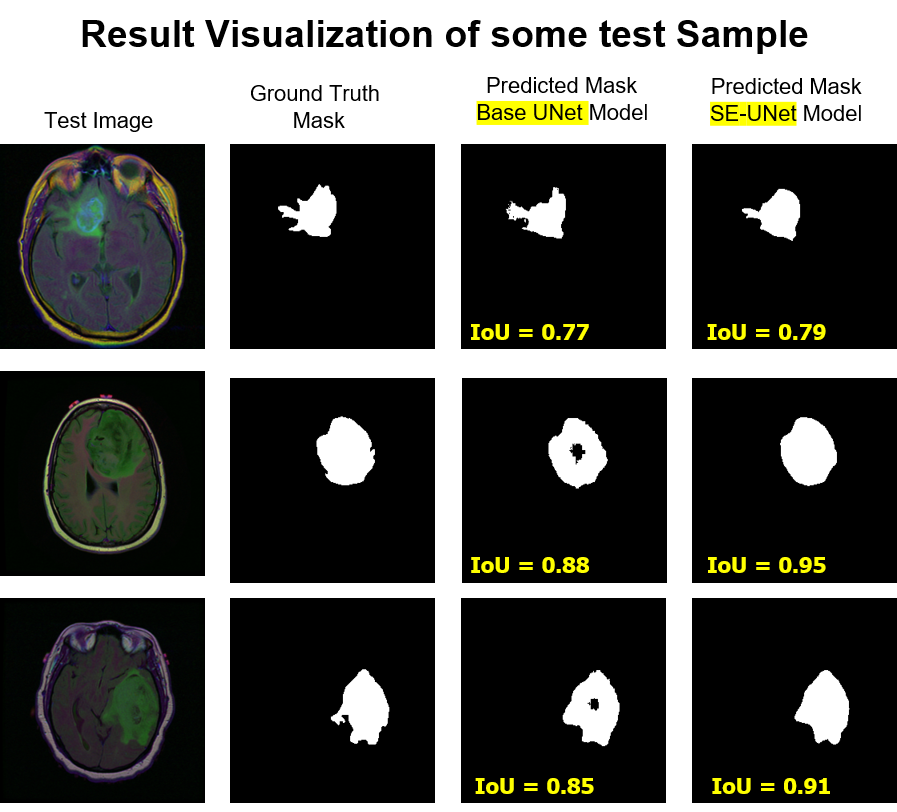
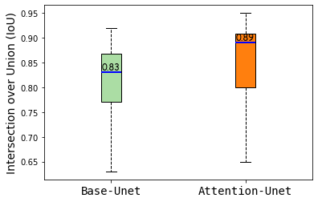
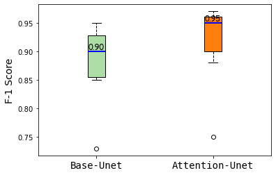

# This is the repository for the segmenattion of Brain MRI image using 
 	### 1. UNET model 
	### 2. Attention based Unet model

## Result Visualization

   

   

   

 

## How to use this code
	###See the instruction.txt file

## Dependencies:
##### python 3.10
##### Tensorflow 2.10##### Keras
and latest version of
##### Numpy
##### Pillow 
##### import os
##### import glob
##### import pathlib
##### import shutil
##### import numpy, matplotlib, PIL, cv2

## Datasets:
	###See the dataset_link.txt file

